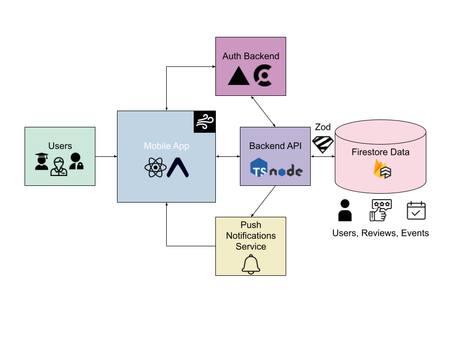

# BU Catering Mobile App (Freebites)

Mobile app for the Freebites project (iOS and Android). Built with Expo + React Native.

This app helps Boston University catering staff reduce food waste by posting leftover catering events so students can pickup free food and leave feedback.

## Project Overview

Freebites is a mobile-first platform that connects catering staff and students to efficiently distribute leftover food from campus events.

#### What the app does

- Students browse available events and leave reviews
- Staff post leftover food events and see student reviews
- Admins manage staff access and permissions
- Push notifications alert users when new events are posted

## User Roles & Permissions

### Students

- View available leftover events
- See event details (location, time, quantity)
- Submit reviews after events

### Staff

- Create and update leftover food events
- View reviews from students

### Admin

- Manage staff accounts (Approve or revoke staff access)
- Can do anything staff can do

## Technical Architecture



### High-Level Flow

1. Users (Staff, Students, Admins) interact with the React Native mobile app
2. The mobile app communicates with:
   - An Authentication Backend (serverless, hosted on Vercel), uses Clerk for roles & authentication
   - A Backend API (Node.js + TypeScript)
3. Data is stored and retrieved from Firebase Firestore. All reads and writes are validated using Zod
4. Expo Push Notifications deliver real-time alerts to users

### Core Components

1. Mobile App
   - Found in `mobile/app`
   - Built with Expo + React Native
   - Handles UI, navigation, and client-side logic
   - Sends authenticated requests to backend services
2. Auth Backend (Serverless)
   - Found in `backend/`
   - Hosted on Vercel
   - Uses Clerk for authentication
   - Clerk metadata is the source of truth for RBAC (student / staff / admin)
   - Issues auth context consumed by the mobile app
3. Node.js + TypeScript
   - Found in `mobile/src/lib/`
   - Reads and writes Firestore data (`lib/firebase/`)
   - Uses schema validation with Zod to ensure data integrity (`lib/schemas/`)
4. Firestore Database
   - Stores core application data: `users`, `events`, `reviews`
   - Used both in production and via the local emulator
5. Push Notifications
   - Found in `mobile/src/lib/`
   - Powered by Expo Push Notification Service
   - Notifies users when:
     - New leftover events are posted
     - Relevant updates occur

## Prerequisites

1. Node 18+ and npm
2. Expo CLI (`npx expo`)
3. Firebase CLI (`npm i -g firebase-tools`)

## Setup Instructions

1. Install Dependencies (run from repo root)

```
npm install --legacy-peer-deps
cd mobile
npm install
```

2. Environment Variables (in `mobile/`)

```
vim mobile/.env.local
```

- Ask BU Spark! for the `.env` format

3. Start Firestore Emulator (from root)

```
npm run emulators
```

4. Seed Sample Data (if desired. from root)

```
npm run seed
```

- This creates sample Events and Reviews if you want to see quickly see dummy data. Data persists locally in `.firebase-data/`.

5. Run the Mobile App

```
cd mobile
npx expo start
```

### Notes

- Usually you have one terminal running `npm run emulators`, a second one to `npm run seed`, and a third one to `cd mobile && npx expo start`.
- `npm run format` within `mobile/` to format with Prettier
